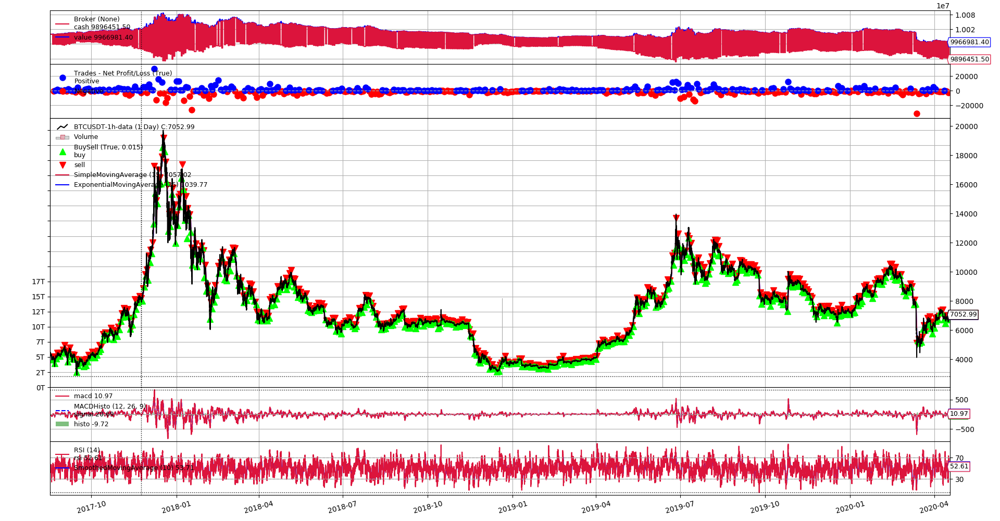

# Task1 Backtest Framework Intro

In this task, you will learn how to use backtest framework to develop trading strategies. Backtest framework takes historical data, buying and selling logic to simulate real-world trades and compute capital gains or losses. There are plenty of open-source backtest framework available on [Github](https://github.com/search?q=backtest)

Popular librarys are [Backtrader](https://www.backtrader.com/), [vnpy](https://www.vnpy.com/), [Zipline](https://github.com/quantopian/zipline), and etc.

This task will guide you to use [Backtrader](https://www.backtrader.com/) to develop trading strategies.

## Required

### 1. Create a Seperate Repo and Virtual Environment

Set up a new folder/repo to do all tasks in section2. Follow the file structure below:

```
project-name
│   README.md
│   requirements.txt    
└───data
│       BTC_USDT_1h
└───log
│       logfile
└───report
        reportfile
```

Note: 
1. Google **requirements.txt** if you don't know, what is it, why use it, how to create one. (python virtual environment is related)
2. It's good practice to create a virtual environment for every project you do. Google it if you don't know. 
3. Recommended virtual environment libraries: venv(built-in), conda, pipenv. I use anaconda based python, so I will go with conda. (Note: you can use conda as a package manager even if you don't use anaconda-based python)

### 2. Read the Doc and Example

[Backtrader Documentation](https://www.backtrader.com/docu/)

[Backtrader Repo](https://github.com/mementum/backtrader)

Backtrader is written elegantly by advanced OOP concepts like metaclass. It might feel difficult at the every beginning of learning it. However, the design pattern and ideas are worthy of spending some time diving into.


### 3. Write a Hello World Strategy

Use one of the [example data](https://github.com/mementum/backtrader/tree/master/datas), write a **script(.py file)**:

- [x] use backtrader adddata to feed data.
- [x] the strategy should have at least one buying and selling.
- [x] use backtrader run to execute.
- [x] use backtrader plot to visulize.

Hint:

1. Follow the [Quickstart Guide](https://www.backtrader.com/docu/quickstart/quickstart/)


### Work log

#### 4/26 

Reviewed Sction 1/task 3. Finished optional task. Made changes based on feedback. 

Read a lot about blockchain tech on [Consensys.net](https://consensys.net). Signed up for this [on-demand course](https://consensys.net/academy/ondemand/).

I will post the notes from above on-demand course as part of my work log in the future.

#### 4/27

Set up new repo and folders. 

Busy day, didn't do much on Section 2/tast 1

#### 4/28

Used conda to set up new env named 'backtrader'

Read about 'requirements.txt' on this article: [Why and How to make a Requirements.txt](https://medium.com/@boscacci/why-and-how-to-make-a-requirements-txt-f329c685181e)

Reading Backtrader docs

#### 4/49

Followed Backtrader Quickstart Guide, implemented `first-strategy.py`. Used the trading strategy provided in the Guide.

Got result `Final Portfolio Value: 9966981.40`

Generated `logfile.txt`. 

Generated following picture using backtrader:




