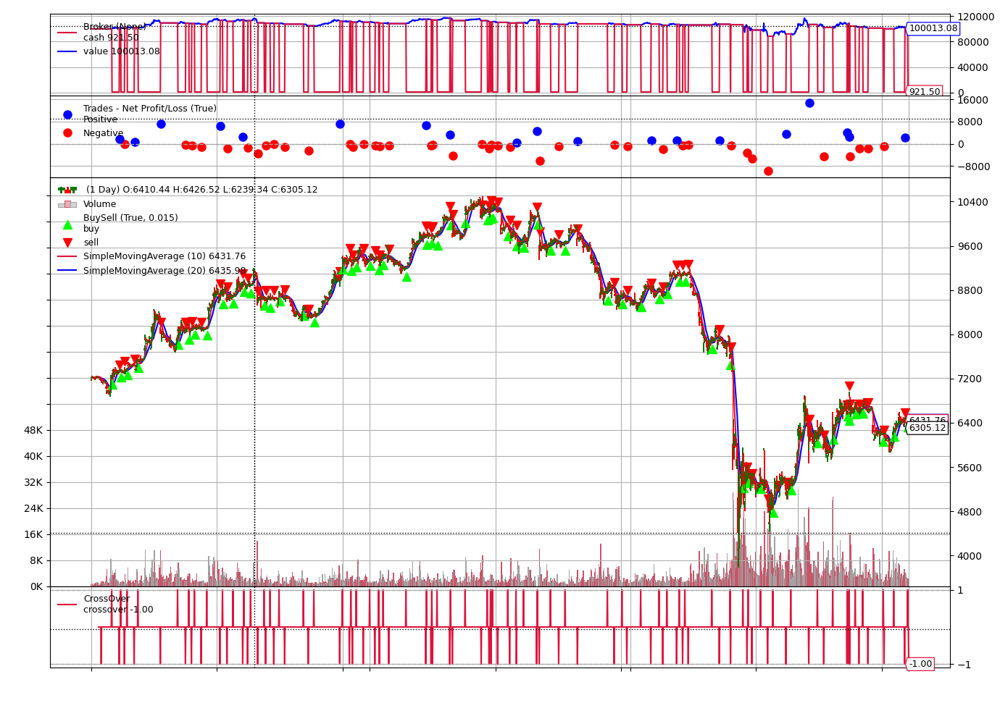
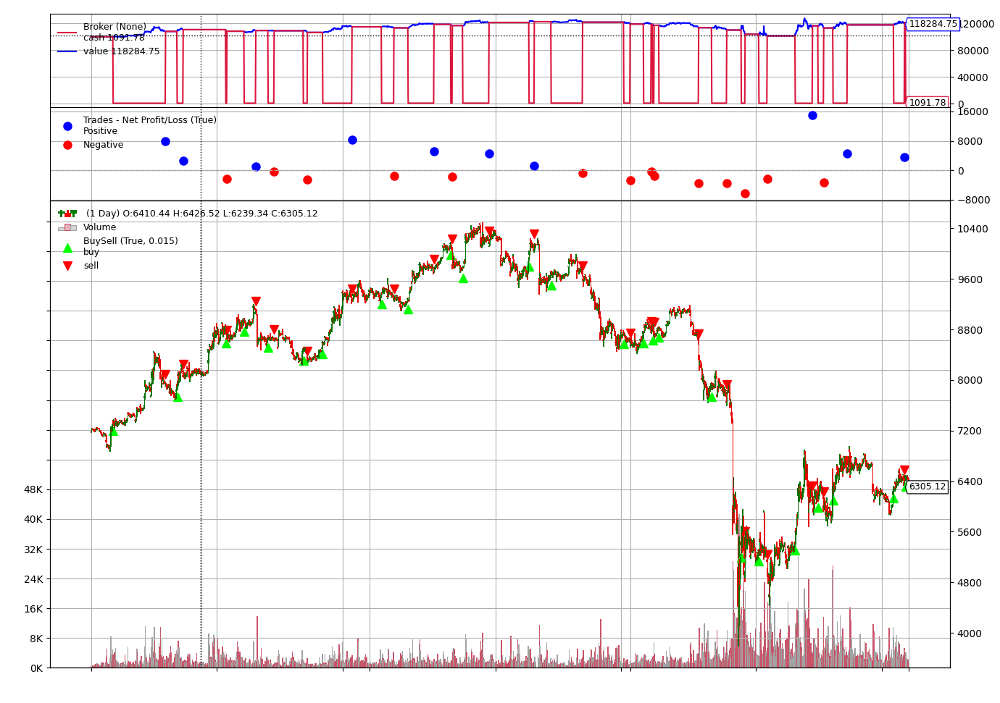
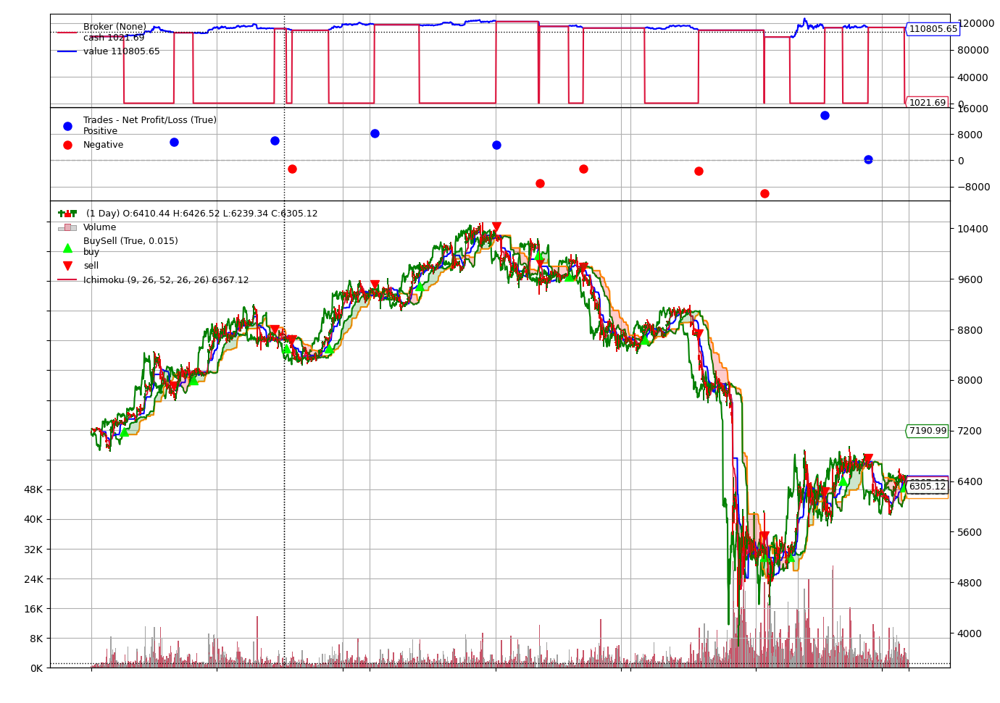

# Task2 Setting Up Backtrader Research Framework

In this task, you will learn to set up backtesting research framework using backtrader, including data fetching and feeding, strategy development, logging and plotting. Finally you will develop a **DoubleSMA** Strategy and another one which out-performs it.

## Required

### 1. Preparation

- [x] copy data_fetcher.py in section1 to root path of this repo, so that you can get **candle/kline** data.
- [x] get candle data of BTCUSDT 1h "2020-01-01" to "2020-04-01", with format same to [BTC_USDT_1h.csv](https://github.com/xyshell/caw-quant-training/blob/master/section1/task1/BTC_USDT_1h.csv), store all data in ./data folder.

Note: 
1. either data fetcher of CryptoCompare or Binance is fine.
2. format the candle data exactly the same with the example given above. (match column names, datetime format, drop unnecessary columns)

### 2. Basic Backtesting Template

Write a SMACross.py like the Hello World Strategy in task 1. Follow the guideline to create a basic template.

1. import all libraries you need, leave one blank line between different parts. e.g:

``` python
# all built-in libraries at the top
import os
import datetime

# all third-party libraries in the middle
import backtrader as bt
import pandas as pd

# all your own modules in the end
from mycode import myfunc
```

2. declear all environment params / global variables. e.g:

``` python
datadir = './data' # data path
logdir = './log' # log path
reportdir = './report' # report path
datafile = 'BTC_USDT_1h.csv' # data file
from_datetime = '2020-01-01 00:00:00' # start time 
to_datetime = '2020-04-01 00:00:00' # end time
``` 

3. define strategy class. e.g:

``` python
class SMACross(bt.Strategy):
    
    params = (
        ('pfast', 10),
        ('pslow', 20),
    )

    def __init__(self):
		pass

	def next(self):
		pass
```

4. initiate cerebro instance:

``` python
cerebro = bt.Cerebro()
```

5. feed data:

``` python
data = pd.read_csv(
    os.path.join(datadir, datafile), index_col='datetime', parse_dates=True)
data = data.loc[
    (data.index >= pd.to_datetime(from_datetime)) &
    (data.index <= pd.to_datetime(to_datetime))]
datafeed = bt.feeds.PandasData(dataname=data)
cerebro.adddata(datafeed)
```

6. feed strategy:

``` python
cerebro.addstrategy(SMACross)
```

6. additional backtest setting:

``` python
cerebro.addsizer(bt.sizers.PercentSizer, percents=99)
cerebro.broker.set_cash(10000)
cerebro.broker.setcommission(commission=0.001)
```

7. add logger:

``` python
cerebro.addwriter(
	bt.WriterFile, 
	out=os.path.join(logdir, logfile),
	csv=True)
```

8. run:

``` python
cerebro.run()
```

9. save report:

``` python
plt.rcParams['figure.figsize'] = [13.8, 10]
fig = cerebro.plot(style='candlestick', barup='green', bardown='red')
fig[0][0].savefig(
	os.path.join(reportdir, figfile),
	dpi=480)
```

Note: 
1. the import rules are not mandatory but good practice to make your code clear.
2. logfile == 'BTC_USDT_1h_SMACross_10_20_2020-01-01_2020-04-01.csv', figfile == 'BTC_USDT_1h_SMACross_10_20_2020-01-01_2020-04-01.png', figure out how to get information like Strategy name and parameter values from cerebro instance.

Hint:
1. after cerebro.run(), print cerebro.strats and how do you say about:

``` python
cerebro.strats[0][0][0]
```
2. how about:

``` python
cerebro.strats[0][0][0].params.__dict__
```

### 3. Double SMA Stratgy

Use the template you create above, write a Double SMA Strategy.

1. figure out what Double SMA Crossover Strategy is, reference:

https://blog.csdn.net/ydjcs567/article/details/61616387

https://blog.csdn.net/weixin_42357472/article/details/82952471

https://www.cnblogs.com/whiteBear/p/12419675.html

Baidu/Google for more.
2. follow the strategy logic and write it in next()
3. use the template to get all results, including log and plot.


### 4. Out-perform SMACross Strategy

Write a strategy which out-performs SMACross Strategy.

Note:
1. you may not change commission fees.
2. you might need to use another indicator.
3. you must interpret the strategy, showing why the improvement makes sense.

## Optional

### 1. Read Backtrader's Doc: platform concepts carefully:

Read this two pages closely: [Platform Concepts](https://www.backtrader.com/docu/concepts/) and [Operating the platform](https://www.backtrader.com/docu/operating/)


### 2. Read other Backtrader's Doc: 

- [x] Data Feeds

[Data Feeds](https://www.backtrader.com/docu/datafeed/)
[Pandas DataFeed Example](https://www.backtrader.com/docu/pandas-datafeed/pandas-datafeed/)

- [x] Strategy

[Strategy](https://www.backtrader.com/docu/strategy/)

- [x] Indicators

[Using Indicators](https://www.backtrader.com/docu/induse/)
[TA-Lib](https://www.backtrader.com/docu/talib/talib/)

- [x] Plotting

[Plotting](https://www.backtrader.com/docu/plotting/plotting/)

Note:
1. always experiment as you read, get the code running on your pc, change some code to test your understanding.
2. pages mentioned above are the most important ones I think.


### Work Log

#### 5/1

Started working on task 2

Read about [Open interest vs Volume](https://www.investopedia.com/ask/answers/050615/what-difference-between-open-interest-and-volume.asp)

#### 5/4

Copied file `data-fetcher.py` to task 2 folder, got data file `BTC_USDT_1h.csv`

Wrote `SMACross.py` template file

Read the given SMA cross strageties.

Implemented Double SMA crossover in `SMACross.py`, generated log file [BTC_USDT_1h_SMACross_10_20_2020-01-01_2020-04-01](./log/BTC_USDT_1h_SMACross_10_20_2020-01-01_2020-04-01.csv)



#### 5/5

Researched strategy that will out perform SMA crossover

I read about the [difference between SMA and EMA](https://forexop.com/strategy/sma-and-ema-crossover/)

Interpret SMA and EMA:

> Simple vs exponential moving averages
> 
> Simple moving averages apply the same weighting to all prices.
>
> On the other hand, exponential moving averages apply higher weighting to more recent prices and lower weighting to price further back in time.
>
> Exponential moving averages would on the face of it seem to be better suited because they will be more responsive to recent price changes. But at the same > time this also makes them more responsive to extreme and sudden price moves. This may or may not be a good thing, depending on the market conditions.
>
> Typically, in SMA and EMA the price taken at each interval is the mid-price. Yet this can change and sometimes the open or close price is preferred.
>
> It appears that the period of moving average will heavily influence the performance of the crossover strategy.

So I tested both SMA & EMA on 10-20, 20-50 and 50-200 setting and I found out that 20-50 EMA has the best performance.

#### 5/6

Finished optional tasks, read through backtrader docs. 

Played some code in file `platform_concept_play.py`

Finished section 2 task 2

I believe there are a lot improvements I can make on the trading strategies such as market order vs limit order, stop loss, buy or sell at more specific points etc. I will update this task.

#### 5/6 - 5/18

I was on and off the project for a few days. 

I took some time to read more about backtrader's doc. Understood more about Lines and datafeed. 

Coporated btreport into task2.

Reorganized folders. Wrote `run.py` to run all strategies. 

New structure:

```
task2
│   README.md
│   requirements.txt 
│   run.py
│   data-fetcher.py
│   report.py   -- btreport
│   utils.py    -- btreport      
└───data
│       BTC_USDT_1h.csv
└───log
│       logfile
└───report
|       reportfile
└───strategies
│       strategy files
└───templates   -- btreport
        template files
```

Reviewed SMACross example and updated `run.py`

Created [strategies](./strategies) folder to contain all strategies classes.

Wrote strategy `FWR.py` by following the logic [here](https://www.investopedia.com/articles/technical/02/052102.asp). The initial result didn't beat SMACross strategy. I added a simple stop loss at 2% to to Four Week Rule to maintain profit.

The final result of four week rule strategy is here:


[btreport here](./report/BTC_USDT_1h_FWR_0.02_2020-01-01_2020-04-01.pdf)

Explored backtrader's github repo, looked into [indicators](https://github.com/mementum/backtrader/tree/master/backtrader/indicators). I used to trade crypto using Ichimoku cloud, so I decided to try out this strategy as an exercise. 

Wrote `IchimokuStrategy.py` followed the trading idea on [stockchart](https://school.stockcharts.com/doku.php?id=technical_indicators:ichimoku_cloud)

The strategy didn't go well at first, but after a stop loss added, it out-performed SMA.



[bt report here](./report/BTC_USDT_1h_IchimokuStrat_9_26_52_26_26_0.02_2020-01-01_2020-04-01.pdf)

